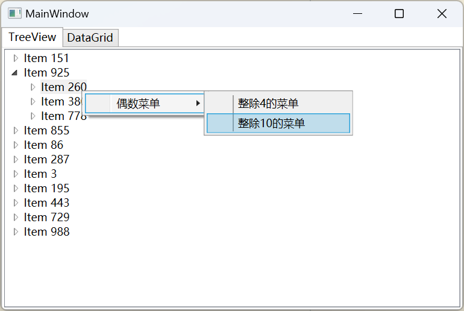
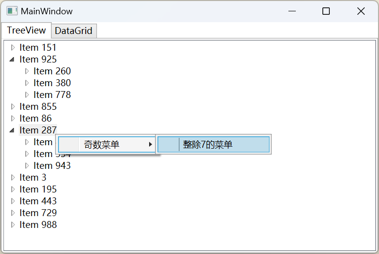
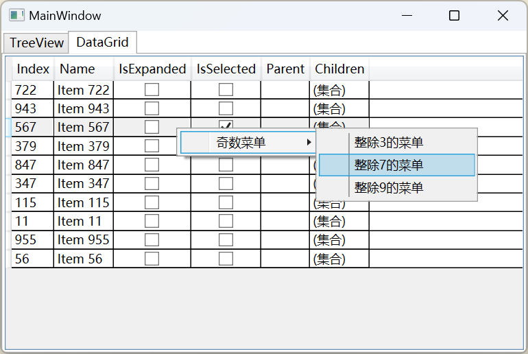
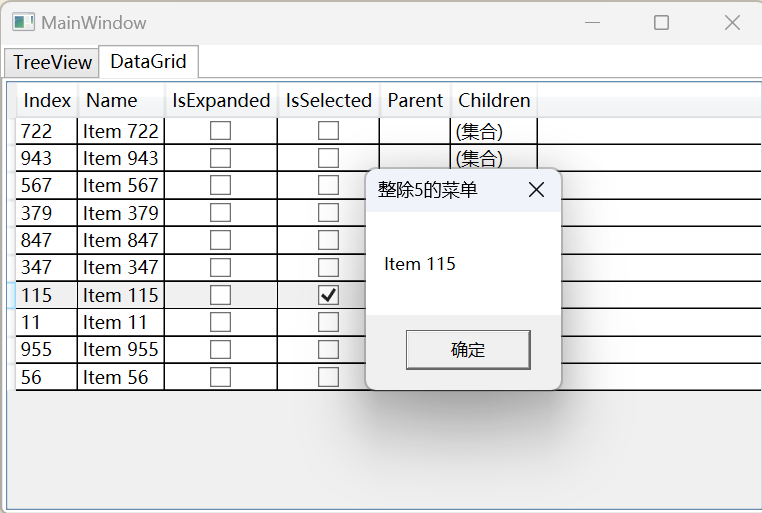

# WPF MVVM 实现列表项动态右键菜单

在某个项目需求中，需要为列表中的每一项都添加一个右键菜单，但是每一项的菜单项是不一样的，有的菜单项需要显示，有的菜单项不需要显示，这就需要动态的去判断哪些菜单项需要显示，哪些菜单项不需要显示。

一种实现的方式是为每种可能的组合预定义多组 `ContextMenu`，然后在右键事件里面去判断需要采用哪组 `ContextMenu`，但这不够优雅，不够 MVVM。

这里我才用另一种方法，核心是通过 `Binding` 时的 `IValueConverter` 动态的去判断哪些菜单项需要显示，哪些不需要显示。

## 效果：

